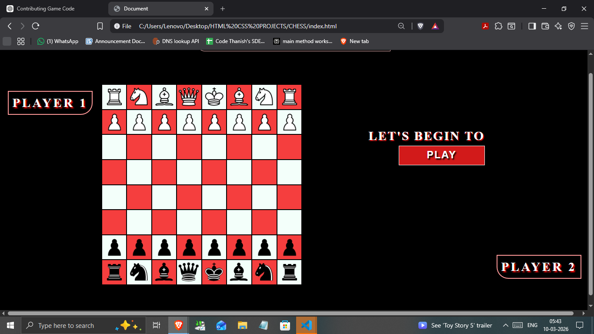

# Chess Game ♟️



This is a simple **Chess Game** created using **HTML, CSS, and JavaScript**.
The project demonstrates chess board creation, piece movement logic, and basic check detection.

---

## 1. Features

* Chess board interface
* Piece movement logic
* Turn-based gameplay
* Basic check detection

---

## 2. Technologies Used

* HTML
* CSS
* JavaScript

---

## 3. How to Run

1. Download or clone the repository
2. Open the project folder
3. Open `index.html` in your web browser

---

## 4. Project Structure

```
chess-game
│
├── index.html
├── style.css
├── script.js
├── README.md
└── images
    └── chess-board.png
```

---

## 5. Current Focus in

* Checkmate detection
* Computer opponent (Without AI)
* Drag and drop piece movement
* Move history display

---

## Author

This project was built as a learning project using **JavaScript**.
